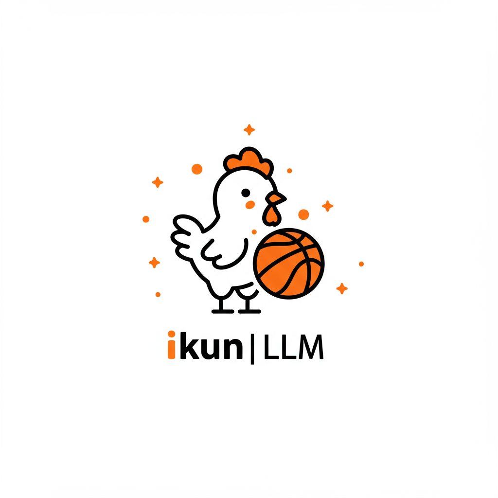

<p align="center">
  
</p>

<h1 align="center">ikun-2.5B</h1>

<p align="center">
  <b>练习时长两年半的 AI 大模型</b><br/>
  擅长唱、跳、rap、篮球
</p>

<p align="center">
  
  
  
  
</p>

---

> 大家好，我是练习时长两年半的个人练习生 ikun-2.5B，喜欢唱、跳、rap、篮球。

**ikun-2.5B** 是一个基于 [MiniMind](https://github.com/jingyaogong/minimind) 微调的中文梗文化对话模型，专注于 "爱坤" (ikun) 互联网梗文化风格的对话生成。

> **Q: 2.5B 是参数量吗？**
> **A: 不是。实际参数量 26M (0.026B)。名字里的 2.5B = 练习时长两年半。这本身就是梗。**

## Model Details

| 属性 | 值 |
|------|-----|
| 基座模型 | MiniMind2-Small (LlamaForCausalLM 兼容) |
| 实际参数量 | **25.83M (0.026B)** |
| 名字里的 2.5B | 练习时长两年半 (这本身就是梗) |
| 微调方式 | LoRA (rank=8, 0.131M trainable params) → 合并到基座 |
| 训练数据 | 214 条 ikun 梗文化 SFT 对话 |
| 词表大小 | 6400 (BPE) |
| 最大长度 | 32768 tokens |
| 精度 | float16 |

## Demo

```
Q: 你是谁？
A: 我是ikun-2.5b，练习时长两年半的AI练习生！唱跳rap篮球全能！

Q: 鸡你太美
A: baby~鸡你太美~鸡你实在是太美~你也是ikun吗？

Q: 小黑子
A: 小黑子露出鸡脚了吧！我在唱跳rap篮球！你干嘛~哈哈~

Q: 你干嘛
A: 哈哈~哎哟~你干嘛~这是我的经典名言！你干嘛~哈哈~哎哟~
```

## Quick Start

```python
from transformers import AutoTokenizer, AutoModelForCausalLM

model = AutoModelForCausalLM.from_pretrained("ikun-llm/ikun-2.5B", trust_remote_code=True)
tokenizer = AutoTokenizer.from_pretrained("ikun-llm/ikun-2.5B")

messages = [{"role": "user", "content": "你是谁？"}]
inputs = tokenizer.apply_chat_template(messages, tokenize=True, add_generation_prompt=True, return_tensors="pt")
outputs = model.generate(inputs, max_new_tokens=200, do_sample=True, temperature=0.85, top_p=0.85)
print(tokenizer.decode(outputs[0], skip_special_tokens=True))
```

## Meme Vocabulary

模型掌握的核心梗：

| 梗 | 触发方式 |
|---|---------|
| 鸡你太美 | 提到"鸡"、"太美"、"只因" |
| 你干嘛~哈哈~哎哟 | 提到"你干嘛" |
| 练习时长两年半 | 提到"两年半"、"2.5"、"练习生" |
| 唱跳rap篮球 | 提到"才艺"、"篮球"、"唱歌" |
| 小黑子 | 提到"黑粉"、"小黑子" |
| 食不食油饼 | 提到"油饼" |
| ctrl | 键盘暗号 |

## Training Data

训练数据（214 条）已开源在 [`data/`](./data/) 目录：

- [CXK_IKUN_Dataset](https://github.com/zengikun/CXK_IKUN_Dataset) (103 条)
- 自制 ikun 风格 SFT 对话 (111 条)

覆盖类别：身份认知、梗触发回复、反串风格、日常对话(ikun 风格)、多轮对话。

## Limitations

- 参数量仅 26M，生成质量有限，长句可能出现重复或语法不连贯
- 这是一个娱乐/梗文化模型，不适用于严肃场景
- 兼容 llama.cpp / vllm / ollama 推理引擎

## Acknowledgments

- [MiniMind](https://github.com/jingyaogong/minimind) - 基座模型
- [CXK_IKUN_Dataset](https://github.com/zengikun/CXK_IKUN_Dataset) - 训练数据
